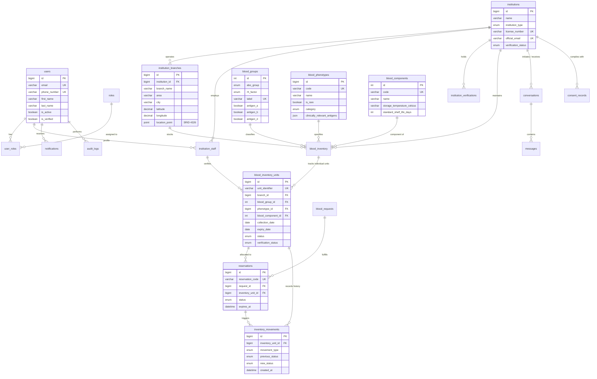

# BLOODBRIDGE ENTITY-RELATIONSHIP (ER) DIAGRAM

```mermaid
erDiagram
    users ||--o{ user_roles : "has"
    roles ||--o{ user_roles : "assigned to"
    users ||--o{ institution_staff : "profile"
    institutions ||--o{ institution_branches : "operates"
    institutions ||--o{ institution_staff : "employs"
    institutions ||--o{ institution_verifications : "holds"
    
    institutions ||--o{ blood_inventory : "maintains"
    institution_branches ||--o{ blood_inventory : "stocks"
    blood_groups ||--o{ blood_inventory : "classifies"
    blood_phenotypes ||--o{ blood_inventory : "specifies"
    blood_components ||--o{ blood_inventory : "component of"

    blood_inventory ||--o{ blood_inventory_units : "tracks individual units"
    institution_staff ||--o{ blood_inventory_units : "verifies"
    
    blood_requests ||--o{ reservations : "fulfills"
    blood_inventory_units ||--o{ reservations : "allocated to"
    blood_inventory_units ||--o{ inventory_movements : "records history"
    reservations ||--o{ inventory_movements : "triggers"
    
    institutions ||--o{ conversations : "initiates / receives"
    conversations ||--o{ messages : "contains"
    users ||--o{ notifications : "receives"
    users ||--o{ audit_logs : "performs"
    institutions ||--o{ consent_records : "complies with"

    users {
        bigint id PK
        varchar email UK
        varchar phone_number UK
        varchar first_name
        varchar last_name
        boolean is_active
        boolean is_verified
    }

    institutions {
        bigint id PK
        varchar name
        enum institution_type
        varchar license_number UK
        varchar official_email UK
        enum verification_status
    }

    institution_branches {
        bigint id PK
        bigint institution_id FK
        varchar branch_name
        varchar area
        varchar city
        decimal latitude
        decimal longitude
        point location_point "SRID 4326"
    }

    blood_groups {
        int id PK
        enum abo_group
        enum rh_factor
        varchar label UK
        boolean antigen_a
        boolean antigen_b
        boolean antigen_d
    }

    blood_phenotypes {
        bigint id PK
        varchar code UK
        varchar name
        boolean is_rare
        enum category
        json clinically_relevant_antigens
    }

    blood_components {
        int id PK
        varchar code UK
        varchar name
        varchar storage_temperature_celsius
        int standard_shelf_life_days
    }

    blood_inventory_units {
        bigint id PK
        varchar unit_identifier UK
        bigint branch_id FK
        int blood_group_id FK
        bigint phenotype_id FK
        int blood_component_id FK
        date collection_date
        date expiry_date
        enum status
        enum verification_status
    }

    reservations {
        bigint id PK
        varchar reservation_code UK
        bigint request_id FK
        bigint inventory_unit_id FK
        enum status
        datetime expires_at
    }

    inventory_movements {
        bigint id PK
        bigint inventory_unit_id FK
        enum movement_type
        enum previous_status
        enum new_status
        datetime created_at
    }
```
